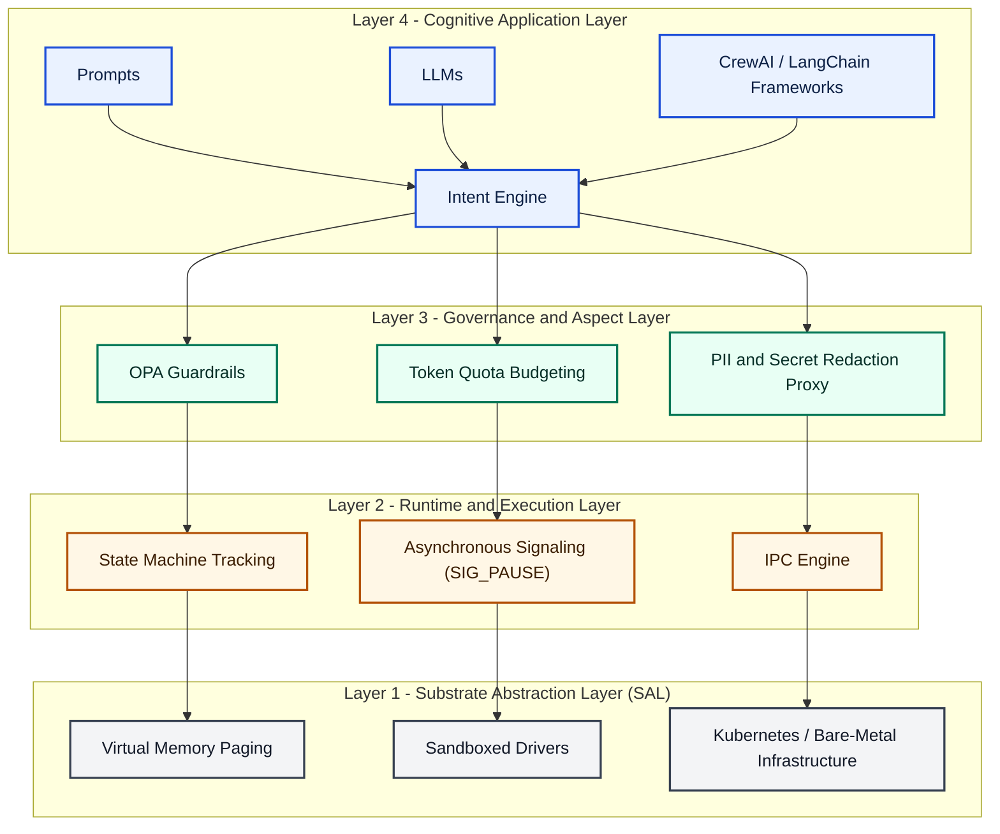
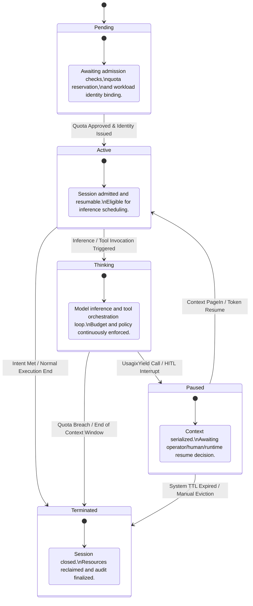

# USAGIX: Universal Substrate for Agent Governance, Isolation and eXecution

> **🚀 Status**: `v0.2-draft` — Seeking RFC participants and early implementers  
> **Ecosystem**: Mantle | **API Version**: `mantle.sh/v1alpha1` | **License**: Apache 2.0

---

## What is USAGIX?

USAGIX is an open interface specification for executing autonomous agent processes under strict substrate governance. It standardizes the boundary between cognitive workloads (LLM inference) and execution substrates, analogous to the role of POSIX between applications and operating systems.

USAGIX defines control-plane and data-plane contracts for:
- **Lifecycle management** (spawn, yield, resume, signal, terminate)
- **Memory virtualization** (L1/L2/L3 paging semantics)
- **Tool mediation** (capability-based access control)
- **Quota enforcement** (token budgets, rate limits)
- **Auditability** (immutable decision logs)

**Substrate-agnostic**: A single USAGIX implementation runs on Kubernetes, serverless platforms, WASM runtimes, or VMs. The spec defines abstract trust-domain architecture; each substrate implements the plumbing differently.

---

## Why USAGIX?

Current agent deployments exhibit five systemic failures:

### The Problem
- **Security Paradox**: High-privilege agents with weak containment and broad network reach
- **Token-Resource Mismatch**: Schedulers reason about CPU/RAM while real bottlenecks are tokens, context windows, and provider quotas
- **Governance Vacuum**: Policy, redaction, and budget logic duplicated in application code instead of the substrate
- **Agent Memory Wall**: Prompt growth, context degradation, and no explicit paging semantics for managing context lifecycle
- **Coordination Chaos**: Recursive loops, orphaned subtasks, and undefined supervision semantics for multi-agent workflows

### The Vision
USAGIX addresses these failures by defining an **operating substrate contract** for agents—not another application framework. It enables enterprises to:

- **Enforce security** through trust-domain separation: untrusted agent code cannot bypass governance
- **Predict resource consumption** by reasoning about tokens, not CPU cycles
- **Simplify compliance** with built-in policy evaluation, redaction, and audit trails
- **Manage complexity** of multi-agent orchestration with deterministic lifecycle and failure semantics
- **Deploy portably** using a single agent manifest across Kubernetes, serverless, WASM, and VM substrates

---

## Architecture Overview

### Trust Domain Separation

USAGIX enforces strict isolation with three trust boundaries:

```
┌─────────────────────────────────────┐
│ Cognitive Container (Untrusted)     │ ← Agent process, LLM inference
├─────────────────────────────────────┤
│ gRPC (Agent Substrate Interface)    │
├─────────────────────────────────────┤
│ Governance Enforcement Plane        │ ← Mediation layer (trusted)
│ (Policy, Capability, Audit)         │
├─────────────────────────────────────┤
│ Tool Executors & Substrate          │ ← Kubernetes, serverless, VMs
└─────────────────────────────────────┘
```

All external actions from the Cognitive Container route through the Governance Enforcement Plane for validation, logging, and constraint enforcement. The agent **cannot** bypass governance.

### USAGIX Protocol Stack



### Agent Lifecycle State Machine



---

## Core Concepts & Specifications

USAGIX defines formal contracts for agent governance. The core specification consists of:

| Concept | Purpose | Learn More |
|---------|---------|-----------|
| **Core Architecture** | Trust domains, semantic types, and foundational contracts | [RFC-0001](RFC/rfc-0001-usagix-core.md) |
| **Agent Lifecycle** | Session state machine, spawn/terminate contracts, checkpoint/restore | [RFC-0002](RFC/rfc-0002-agent-lifecycle.md) |
| **Memory Model** | L1/L2/L3 paging, context pressure index, memory virtualization | [RFC-0003](RFC/rfc-0003-memory-model.md) |
| **Governance Model** | Policy evaluation (OPA), capability ledger, audit trail, output redaction | [RFC-0004](RFC/rfc-0004-governance-model.md) |
| **ASI System Calls** | 10 gRPC system calls for agent-substrate communication | [RFC-0005](RFC/rfc-0005-asi-system-calls.md) |
| **Security Model** | Threat model (STRIDE), isolation guarantees, cryptographic signing | [RFC-0006](RFC/rfc-0006-security-model.md) |
| **Inference Scheduler** | Token burn rate prediction, context pressure, rate limit enforcement | [RFC-0007](RFC/rfc-0007-inference-scheduler.md) |
| **Multi-Agent Coordination** | Process trees, budget partitioning, failure cascade, deadlock prevention | [RFC-0008](RFC/rfc-0008-multi-agent-coordination.md) |

### Design Principles

USAGIX follows eight core principles:

- **Zero Trust by Default** — Agents cannot bypass governance through prompt injection or logic exploits
- **Governance Outside the Trust Boundary** — Policy decisions made by untrusted code are invalid; only substrate enforcement counts
- **Tool Calls as System Calls** — Agent tool invocations are system calls, mediated by the substrate and auditable
- **Tokens as Schedulable Resources** — Tokens, not CPU cycles, are the primary scheduling dimension for cognitive workloads
- **Context as Virtual Memory** — Context management is analogous to OS virtual memory: transparent paging, tier management, pressure feedback
- **Cognitive Workloads as Processes** — Agents are stateful processes with lifecycle, identity, and resource quotas
- **Deterministic Lifecycle Management** — State transitions are deterministic; identical inputs produce identical outcomes
- **Portable Agent Substrates** — A single agent manifest runs on Kubernetes, serverless, WASM, and VMs

---

## Reference Implementation: Myelin-AX

**Myelin-AX** is a Kubernetes-native reference implementation of USAGIX. It uses Kubernetes CRDs, an operator, and sidecar-based governance to enforce zero-trust execution for agents.

### Hello World: Agent Manifest

Here's a minimal USAGIX agent (Mantle ecosystem format):

```yaml
apiVersion: mantle.sh/v1alpha1
kind: SovereignAgent

metadata:
  name: research-assistant
  labels:
    team: research
    environment: production

spec:
  runtime:
    profile: standard
    maxTokensQuota: 10000000      # 10M tokens per session
    sessionTimeoutSeconds: 3600   # 1 hour timeout

  security:
    sandboxLevel: moderate         # Balanced isolation
    allowedTools:
      - web.search
      - database.query
      - file.read

  memory:
    l1ContextWindow: 100000        # 100K token context
    l2CacheProvider: "redis://cache.internal:6379"
    l3ColdStorageProvider: "s3://agents/sessions"

  identity:
    modelId: claude-3.5-sonnet
    systemPrompt: |
      You are a research assistant. Strengths: retrieval, synthesis, clarity.
      Constraints: cite sources; do not make up data.
```

### How USAGIX and Myelin-AX Relate

| Concept | USAGIX (Spec) | Myelin-AX (Implementation) |
|---------|---------------|---------------------------|
| Agent Container | Cognitive Container (abstract) | Kubernetes Pod with agent-brain container |
| Governance | Governance Enforcement Plane (abstract) | myelin-proxy sidecar + OPA |
| Tool Execution | Tool Executor (abstract) | myelin-sandbox container with gVisor |
| Memory Tiers | L1/L2/L3 (abstract paging) | In-memory + Redis + S3 |
| Identity & Auth | Cryptographic workload identity | Kubernetes ServiceAccount + mTLS |

For Kubernetes-specific details, see [reference/myelin-ax/ARCHITECTURE.md](reference/myelin-ax/ARCHITECTURE.md).

---

## Documentation

### Getting Started & Overview

- **[docs/README.md](docs/README.md)** — Documentation index organized by role and use case
- **[CONTRIBUTING.md](CONTRIBUTING.md)** — How to contribute (RFC process, DCO requirements)
- **[ROADMAP.md](ROADMAP.md)** — Multi-year evolution plan and contribution areas

### Reference Implementation & Deployment

- **[reference/myelin-ax/ARCHITECTURE.md](reference/myelin-ax/ARCHITECTURE.md)** — Myelin-AX design and USAGIX mapping
- **[reference/myelin-ax/deployment/](reference/myelin-ax/deployment/)** — Kubernetes manifests and deployment examples
- **[reference/myelin-ax/policies/](reference/myelin-ax/policies/)** — Example OPA governance policies

### Specifications & Architecture

- **[RFC/](RFC/)** — Request for Comments (formal proposals and approved RFCs)
  - [RFC-0001: Core Architecture](RFC/rfc-0001-usagix-core.md)
  - [RFC-0002: Agent Lifecycle](RFC/rfc-0002-agent-lifecycle.md)
  - [RFC-0003: Memory Model](RFC/rfc-0003-memory-model.md)
  - [RFC-0004: Governance Model](RFC/rfc-0004-governance-model.md)
  - [RFC-0005: ASI System Calls](RFC/rfc-0005-asi-system-calls.md)
  - [RFC-0006: Security Model](RFC/rfc-0006-security-model.md)
  - [RFC-0007: Inference Scheduler](RFC/rfc-0007-inference-scheduler.md)
  - [RFC-0008: Multi-Agent Coordination](RFC/rfc-0008-multi-agent-coordination.md)

- **[architecture/](architecture/)** — Architecture documentation and design decisions
- **[spec/](spec/)** — Detailed specification documents
  - [Core Architecture](spec/usage-core.md)
  - [Security Model](spec/security-model.md)
  - [Memory Model](spec/memory-model.md)
  - [Governance Model](spec/governance-model.md)
  - [Runtime State Machine](spec/runtime-state-machine.md)
  - [ASI System Calls](spec/asi-system-calls.md)
  - [Versioning Policy](spec/versioning.md)

---

## Community & Governance

### Contributing

- **[CONTRIBUTING.md](CONTRIBUTING.md)** — How to contribute (bug reports, RFCs, pull requests)
- **[CHARTER.md](CHARTER.md)** — Project charter, mission, and governance structure

### Compliance & Security

- **[SECURITY.md](SECURITY.md)** — Security guarantees, vulnerability disclosure, and best practices
- **[CODE_OF_CONDUCT.md](CODE_OF_CONDUCT.md)** — Community guidelines

### Roadmap & Adoption

- **[ROADMAP.md](ROADMAP.md)** — Multi-year evolution plan (v1.0 stable → v2.0 breaking changes → CNCF graduation)
- **[ADOPTERS.md](ADOPTERS.md)** — Organizations implementing USAGIX; how to add your implementation

### Legal

- **[LICENSING.md](LICENSING.md)** — Apache 2.0 license and licensing FAQ
- **[TRADEMARK_POLICY.md](TRADEMARK_POLICY.md)** — Trademark usage guidelines

---

## Next Steps

### For Specification Readers
1. Read the [What is USAGIX?](#what-is-usagix) section above
2. Explore the [Core Concepts table](#core-concepts--specifications) and dive into relevant RFCs
3. Review [design principles](#design-principles) and [architecture overview](#architecture-overview)

### For Implementers
1. Start with [Myelin-AX ARCHITECTURE.md](reference/myelin-ax/ARCHITECTURE.md) to understand how USAGIX maps to Kubernetes
2. Review [RFC-0005 (ASI System Calls)](RFC/rfc-0005-asi-system-calls.md) for gRPC contract details
3. Examine [reference/myelin-ax/deployment/](reference/myelin-ax/deployment/) for example manifests

### For Adopters & Users
1. Review the [Hello World manifest](#hello-world-agent-manifest) above
2. Explore [reference/myelin-ax/policies/](reference/myelin-ax/policies/) for governance policy examples
3. See [ADOPTERS.md](ADOPTERS.md) for organizations using USAGIX and deployment patterns

### For Contributors
1. Read [CONTRIBUTING.md](CONTRIBUTING.md) for process and DCO requirements
2. Check [ROADMAP.md](ROADMAP.md) for planned work and contribution areas
3. Propose significant changes as RFCs using [RFC/README.md](RFC/README.md) process

---

## Project Status

- **Version**: `v0.2-draft`
- **Maturity**: Draft specification; seeking RFC participants and early implementers
- **Track**: Public specification → reference implementation (Myelin-AX) → conformance publication → CNCF standardization
- **License**: Apache 2.0
- **Governance**: See [GOVERNANCE.md](GOVERNANCE.md)

For the latest updates, see [ROADMAP.md](ROADMAP.md).
