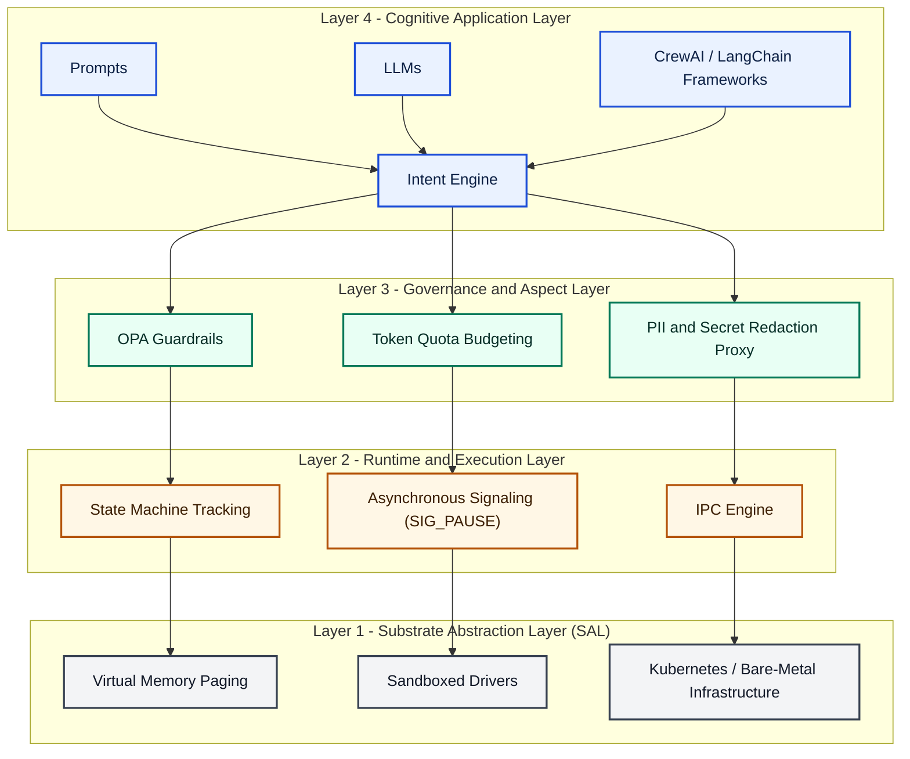
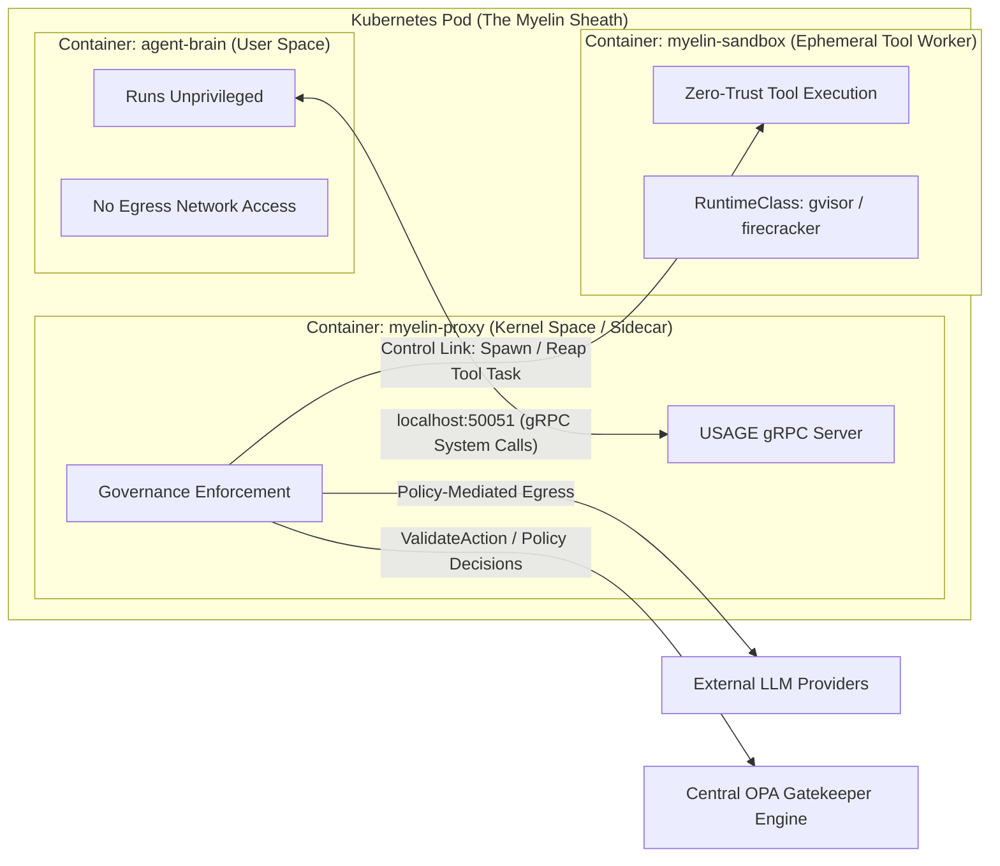
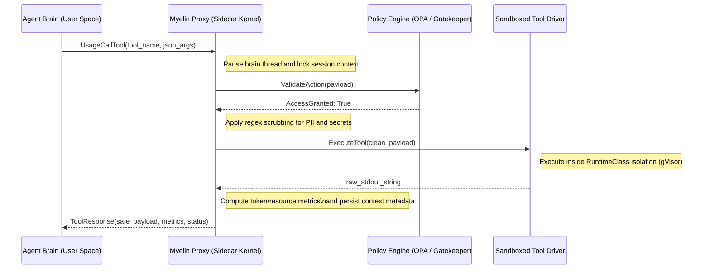

# USAGE: Universal Substrate for Agent Governance Enforcement

## Executive Summary
USAGE is an open interface specification for executing autonomous agent processes under strict substrate governance. It standardizes the boundary between cognitive workloads and execution substrates, analogous to the role of POSIX between applications and operating systems. USAGE defines control-plane and data-plane contracts for lifecycle, signaling, memory paging, tool mediation, quota enforcement, and auditability.

Myelin-AX is the Kubernetes-native reference implementation of USAGE. It uses CRDs, an operator, mutating admission, and sidecar-based governance to enforce zero-trust execution semantics for agent processes.

## The Case for an Agent OS
USAGE addresses not only technical orchestration but also enterprise governance and liability requirements for autonomous digital workers.

See: [case-for-agent-os.md](spec/case-for-agent-os.md)

## Problem Statement
Current agent deployments exhibit five systemic failures:
- Security paradox: high-privilege agents with weak containment and broad network reach.
- Token-resource mismatch: schedulers reason about CPU/RAM while real bottlenecks are tokens, context windows, and provider quotas.
- Governance vacuum: policy, redaction, and budget logic duplicated in application code.
- Agent memory wall: prompt growth, context degradation, and no explicit paging semantics.
- Coordination chaos: recursive loops, orphaned subtasks, and undefined supervision semantics.

USAGE addresses these failures by defining an operating substrate contract instead of another application framework.

## Definitive Scope Trigger
USAGE uses an operational binary for classification. A workload is classified as an AI Agent under USAGE when both are true:
- Inference Core Invocation: it invokes one or more foundation model or LLM calls to determine state or control flow.
- Peripheral Access Capabilities: it can invoke external tools, databases, web APIs, or native host system calls.

This rule applies to scripts, binaries, background services, and active workload threads regardless of complexity.

## Absolute Boundary Condition
No exemptions are granted based on implementation size or framework choice. Once the scope trigger is satisfied, the workload is inside the USAGE runtime boundary and MUST:
- Relinquish direct external side-effect pathways outside substrate mediation.
- Authenticate through a distinct cryptographically verifiable workload identity.
- Route all external actions through substrate tool-proxy enforcement.
- Submit to real-time token accounting and quota enforcement.

Substrate non-compliance handling is terminal (`SIG_AGENT_TERMINATE`).

## Design Principles
- Zero Trust by Default
- Governance Outside the Trust Boundary
- Tool Calls as System Calls
- Tokens as Schedulable Resources
- Context as Virtual Memory
- Cognitive Workloads as Processes
- Deterministic Lifecycle Management
- Portable Agent Substrates

## Protocol Stack
USAGE specifies a four-layer stack:
- Layer 4: Cognitive Application Layer
- Layer 3: Governance and Aspect Layer
- Layer 2: Runtime and Execution Layer
- Layer 1: Substrate Abstraction Layer (SAL)

Detailed specification: [usage-core.md](spec/usage-core.md)

## Runtime Architecture
Myelin-AX enforces USAGE through out-of-process supervision:
- `agent-brain`: untrusted cognition container.
- `myelin-proxy`: privileged governance sidecar implementing ASI server.
- `myelin-sandbox`: ephemeral isolated compute worker for untrusted tool execution.

Kubernetes topology and flow diagrams: [kubernetes-architecture.md](spec/kubernetes-architecture.md)

## System Calls (ASI)
USAGE defines the Agent Substrate Interface over gRPC:
- `UsageSpawn`
- `UsageYield`
- `UsageSignal`
- `UsageMemPageOut`
- `UsageCallTool`

Formal contracts: [asi.proto](proto/usage/v1/asi.proto)

System-call semantics: [asi-system-calls.md](spec/asi-system-calls.md)

## Security Model
Security boundaries and mandatory controls are defined in:
- [security-model.md](spec/security-model.md)
- [threat-model.md](spec/threat-model.md)

## Memory Model
USAGE defines hierarchical memory tiers (L1/L2/L3), eviction semantics, and page-out contracts:
- [memory-model.md](spec/memory-model.md)

## Scheduling Model
USAGE introduces inference-aware scheduling primitives (token budget classes, context pressure, provider quota backpressure):
- [scheduling-model.md](spec/scheduling-model.md)

## Governance Model
USAGE governance pipeline externalizes policy, redaction, retries, idempotency, and audit semantics:
- [governance-model.md](spec/governance-model.md)

## Multi-Agent Coordination Model
USAGE models supervised process trees, parent-child ownership, escalation, and deadlock handling:
- [coordination-model.md](spec/coordination-model.md)

## Kubernetes Integration
Reference CRDs and lifecycle mappings:
- [sovereignagent.example.yaml](crds/sovereignagent.example.yaml)
- [agentsession.example.yaml](crds/agentsession.example.yaml)
- [rfc-001-lifecycle.md](spec/rfc-001-lifecycle.md)

## Compliance Suite
USAGE conformance is profile-based:
- Core ASI Conformance
- Governance Conformance
- Isolation Conformance
- Observability Conformance

Suite design and test matrix:
- [compliance-suite.md](spec/compliance-suite.md)
- [asi-compliance-tests.md](compliance-tests/asi-compliance-tests.md)

## OpenTelemetry Semantic Conventions Proposal
USAGE proposes agent-runtime semantic attributes and events:
- [otel-semconv-proposal.md](spec/otel-semconv-proposal.md)

## CNCF Positioning and Roadmap
- CNCF standardization path: [cncf-positioning.md](spec/cncf-positioning.md)
- Standards-track roadmap: [standardization-roadmap.md](spec/standardization-roadmap.md)

## Architecture Diagrams

### 1) USAGE Protocol Stack
Source: [usage-protocol-stack.mmd](diagrams/usage-protocol-stack.mmd)

### 2) Myelin-AX Kubernetes Pod Topography
Source: [myelin-ax-pod-topography.mmd](diagrams/myelin-ax-pod-topography.mmd)

### 3) USAGE Process Lifecycle State Machine
Source: [usage-lifecycle-state-machine.mmd](diagrams/usage-lifecycle-state-machine.mmd)

### 4) UML System Call Sequence (Tool Execution Flow)
Source: [usage-tool-execution-sequence.mmd](diagrams/usage-tool-execution-sequence.mmd)

## Appendix
- Protobuf contracts: [asi.proto](proto/usage/v1/asi.proto)
- JSON schema: [agent_manifest.schema.json](schemas/agent_manifest.schema.json)
- Examples: [agent_manifest_basic.yaml](examples/agent_manifest_basic.yaml), [agent_manifest_advanced.yaml](examples/agent_manifest_advanced.yaml)

## Status
- Version: `v0.2-draft`
- Maturity: Draft for implementer review
- Intended process: public specification -> reference implementation hardening -> conformance publication
