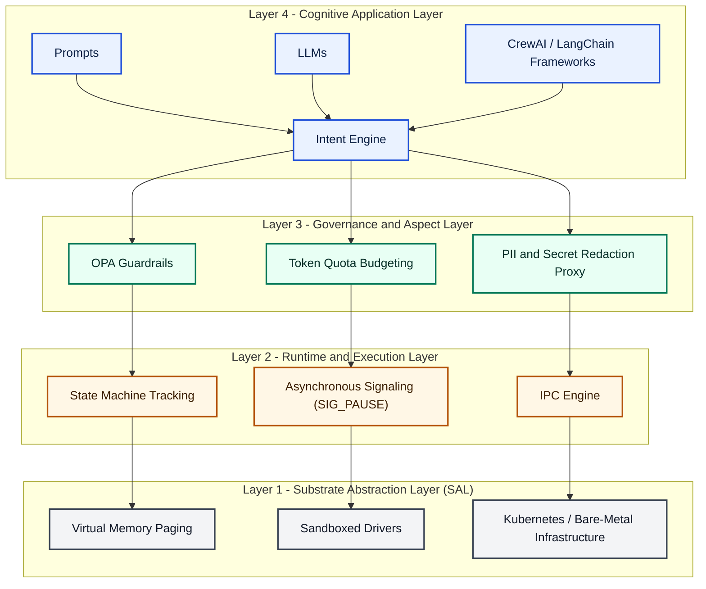
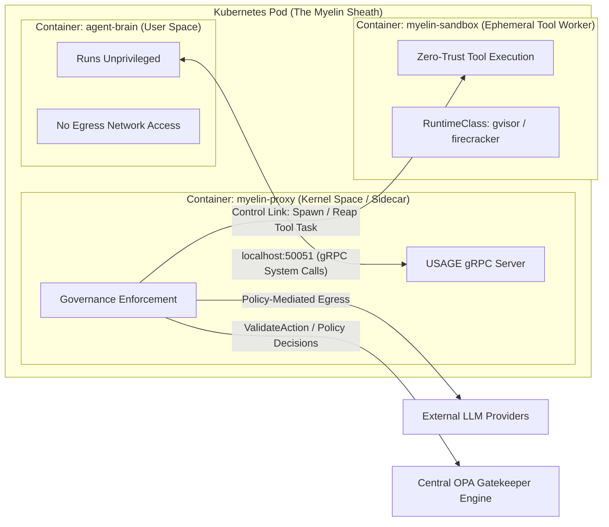
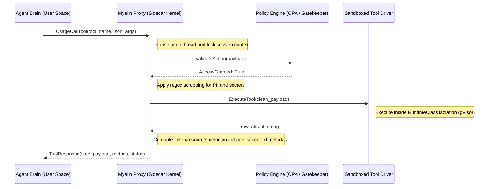

# USAGE: Universal Substrate for Agent Governance Enforcement

## Executive Summary
USAGE is an open interface specification for executing autonomous agent processes under strict substrate governance. It standardizes the boundary between cognitive workloads and execution substrates, analogous to the role of POSIX between applications and operating systems. USAGE defines control-plane and data-plane contracts for lifecycle, signaling, memory paging, tool mediation, quota enforcement, and auditability.

Myelin-AX is the Kubernetes-native reference implementation of USAGE. It uses CRDs, an operator, mutating admission, and sidecar-based governance to enforce zero-trust execution semantics for agent processes.

## The Case for an Agent OS

Expand The Case for an Agent OS

USAGE addresses not only technical orchestration but also enterprise governance and liability requirements for autonomous digital workers.

See: [case-for-agent-os.md](spec/case-for-agent-os.md)

## Problem Statement

Expand Problem Statement

Current agent deployments exhibit five systemic failures:
- Security paradox: high-privilege agents with weak containment and broad network reach.
- Token-resource mismatch: schedulers reason about CPU/RAM while real bottlenecks are tokens, context windows, and provider quotas.
- Governance vacuum: policy, redaction, and budget logic duplicated in application code.
- Agent memory wall: prompt growth, context degradation, and no explicit paging semantics.
- Coordination chaos: recursive loops, orphaned subtasks, and undefined supervision semantics.

USAGE addresses these failures by defining an operating substrate contract instead of another application framework.

## Definitive Scope Trigger

Expand Definitive Scope Trigger

USAGE uses an operational binary for classification. A workload is classified as an AI Agent under USAGE when both are true:
- Inference Core Invocation: it invokes one or more foundation model or LLM calls to determine state or control flow.
- Peripheral Access Capabilities: it can invoke external tools, databases, web APIs, or native host system calls.

This rule applies to scripts, binaries, background services, and active workload threads regardless of complexity.

## Absolute Boundary Condition

Expand Absolute Boundary Condition

No exemptions are granted based on implementation size or framework choice. Once the scope trigger is satisfied, the workload is inside the USAGE runtime boundary and MUST:
- Relinquish direct external side-effect pathways outside substrate mediation.
- Authenticate through a distinct cryptographically verifiable workload identity.
- Route all external actions through substrate tool-proxy enforcement.
- Submit to real-time token accounting and quota enforcement.

Substrate non-compliance handling is terminal (`SIG_AGENT_TERMINATE`).

## Design Principles

Expand Design Principles

- Zero Trust by Default
- Governance Outside the Trust Boundary
- Tool Calls as System Calls
- Tokens as Schedulable Resources
- Context as Virtual Memory
- Cognitive Workloads as Processes
- Deterministic Lifecycle Management
- Portable Agent Substrates

## Protocol Stack

Expand Protocol Stack

USAGE specifies a four-layer stack:
- Layer 4: Cognitive Application Layer
- Layer 3: Governance and Aspect Layer
- Layer 2: Runtime and Execution Layer
- Layer 1: Substrate Abstraction Layer (SAL)

Detailed specification: [usage-core.md](spec/usage-core.md)

## Runtime Architecture

Expand Runtime Architecture

Myelin-AX enforces USAGE through out-of-process supervision:
- `agent-brain`: untrusted cognition container.
- `myelin-proxy`: privileged governance sidecar implementing ASI server.
- `myelin-sandbox`: ephemeral isolated compute worker for untrusted tool execution.

Kubernetes topology and flow diagrams: [kubernetes-architecture.md](spec/kubernetes-architecture.md)

## System Calls (ASI)

Expand System Calls (ASI)

USAGE defines the Agent Substrate Interface over gRPC:
- `UsageSpawn`
- `UsageYield`
- `UsageSignal`
- `UsageMemPageOut`
- `UsageCallTool`

Formal contracts: [asi.proto](proto/usage/v1/asi.proto)

System-call semantics: [asi-system-calls.md](spec/asi-system-calls.md)

## Security Model

Expand Security Model

Source: [security-model.md](spec/security-model.md)

## Objectives
- Constrain blast radius of compromised cognition workloads.
- Prevent direct credential and network exfiltration.
- Enforce policy on every side effect.

## Mandatory Controls
- Sidecar governance enforcement out-of-process.
- Least-privilege tool capability allowlists.
- Runtime sandboxing for dynamic code execution.
- Immutable audit trail for syscall decisions.
- Identity-bound quotas and policy snapshots.

## Trust Domains
- Domain A: Untrusted cognition (`agent-brain`).
- Domain B: Trusted governance (`myelin-proxy`).
- Domain C: Isolated executor (`myelin-sandbox`).
- Domain D: Control plane (operator, admission, policy backend).

## Security Invariants
- A cannot directly invoke D or external networks.
- A -> side effects MUST traverse B.
- C instances are ephemeral and non-reusable.

## Memory Model

Expand Memory Model

Source: [memory-model.md](spec/memory-model.md)

## Tiers
- L1 Hot Context: model-visible active window.
- L2 Warm Semantic Cache: low-latency retrieved context.
- L3 Cold Persistent Store: long-term durable memory.

## Page Semantics
- Page Unit: opaque context segment with policy labels.
- Page Metadata: `{page_id, hash, sensitivity, ttl, lineage}`.
- `UsageMemPageOut` demotes pages L1->L2/L3.

## Invariants
- Sensitive pages MUST carry policy labels across tiers.
- Page references MUST be integrity-verifiable.
- Expired pages MUST be unavailable to retrieval unless retention exception applies.

## Memory Wall Handling
- Trigger demotion by token pressure threshold.
- Maintain retrieval quality via semantic compaction.
- Avoid unbounded prompt growth by bounded L1 resident set.

## Scheduling Model

Expand Scheduling Model

Source: [scheduling-model.md](spec/scheduling-model.md)

## Problem
CPU/RAM scheduling is insufficient for cognitive workloads that are quota-bound by tokens, context windows, and provider rate limits.

## Scheduling Dimensions
- Compute: CPU, memory, accelerator
- Cognitive: token budget, token rate, context pressure
- External: provider QPS/TPM, tool concurrency

## Policies
- Token Budget Class: `small`, `medium`, `large` with hard upper bounds.
- Context Pressure Index (CPI): ratio of L1 occupancy to configured max.
- Provider Backpressure State: normal, degraded, blocked.

## Decisions
- Admit when quotas and policy permit.
- Preempt/terminate when token budget exhausted.
- Force yield when CPI exceeds threshold.
- Defer tool calls under provider backpressure.

## Governance Model

Expand Governance Model

Source: [governance-model.md](spec/governance-model.md)

## Pipeline
1. Parse syscall request.
2. Resolve identity and session policy snapshot.
3. Run OPA policy evaluation.
4. Apply redaction/scrubbing transforms.
5. Enforce budget and concurrency guards.
6. Execute or deny.
7. Emit audit and telemetry records.

## Idempotency
- Tool calls SHOULD carry idempotency keys.
- Retries MUST preserve policy context and audit correlation ids.

## Audit
Each decision MUST record:
- session id
- syscall
- policy bundle version
- allow/deny outcome
- rationale code
- latency and resource metrics

## Multi-Agent Coordination Model

Expand Multi-Agent Coordination Model

Source: [coordination-model.md](spec/coordination-model.md)

## Process Tree
USAGE models agent orchestration as a supervision tree.
- Parent sessions own child sessions.
- Ownership includes budget partitioning and termination semantics.

## Spawn Semantics
- Parent MAY allocate sub-budget to child at `UsageSpawn`.
- Child MUST inherit policy floor from parent; narrowing is allowed, widening is denied.

## Failure Semantics
- Child failure can be `isolated` or `escalating` based on parent policy.
- Cascading termination behavior is explicit (`NONE`, `CHILDREN`, `SUBTREE`).

## Deadlock and Loop Control
- Maximum recursion depth MUST be bounded.
- Repeated identical tool-call signatures SHOULD trigger circuit-breaker policy.

## Kubernetes Integration

Expand Kubernetes Integration

Reference CRDs and lifecycle mappings:
- [sovereignagent.example.yaml](crds/sovereignagent.example.yaml)
- [agentsession.example.yaml](crds/agentsession.example.yaml)
- [rfc-001-lifecycle.md](spec/rfc-001-lifecycle.md)

## Compliance Suite

Expand Compliance Suite

Source: [compliance-suite.md](spec/compliance-suite.md)

## Profiles
- Core Profile: ASI syscall semantics and lifecycle state machine.
- Governance Profile: policy enforcement, redaction, idempotency.
- Isolation Profile: network isolation and sandbox integrity.
- Observability Profile: required events, attributes, and traces.

## Test Categories
- Protocol tests: request/response compatibility and error codes.
- Behavioral tests: legal/illegal state transitions.
- Security tests: deny-path guarantees and boundary bypass attempts.
- Performance tests: control-plane overhead and signal latency.

## Pass Criteria
Implementation is compliant when all mandatory tests pass for declared profile.

## OpenTelemetry Semantic Conventions Proposal

Expand OpenTelemetry Semantic Conventions Proposal

Source: [otel-semconv-proposal.md](spec/otel-semconv-proposal.md)

## Scope
Defines telemetry attributes and events for USAGE substrates.

## Resource Attributes
- `usage.substrate.name`
- `usage.substrate.version`
- `usage.session.id`
- `usage.agent.blueprint`

## Span Attributes
- `usage.syscall.name`
- `usage.syscall.result`
- `usage.policy.decision`
- `usage.policy.bundle.version`
- `usage.token.consumed`
- `usage.token.remaining`
- `usage.memory.tier.target`
- `usage.tool.name`

## Events
- `usage.state.transition`
- `usage.signal.delivered`
- `usage.pageout.completed`
- `usage.tool.denied`
- `usage.quota.exhausted`

## Metric Suggestions
- `usage_syscall_latency_ms`
- `usage_policy_denials_total`
- `usage_tokens_consumed_total`
- `usage_active_sessions`
- `usage_pageout_operations_total`

## CNCF Positioning and Roadmap

Expand CNCF Positioning and Roadmap

- CNCF standardization path: [cncf-positioning.md](spec/cncf-positioning.md)
- Standards-track roadmap: [standardization-roadmap.md](spec/standardization-roadmap.md)

## Threat Model

Expand Threat Model

Source: [threat-model.md](spec/threat-model.md)

## Threat Classes
- Prompt injection
- Tool hijacking
- Credential exfiltration
- Lateral movement
- Sandbox escape
- Poisoned retrieval memory
- Recursive execution loops
- Denial-of-wallet
- Covert prompt exfiltration

## STRIDE Mapping (Summary)
- Spoofing: forged session or tool identity
- Tampering: checkpoint/page mutation
- Repudiation: missing immutable audit records
- Information Disclosure: secret leakage via outputs/tools
- Denial of Service: token or tool saturation
- Elevation of Privilege: bypassing tool/policy boundary

## Mitigation Matrix
- Prompt injection -> policy-typed tool arguments + deny-by-default tool scopes
- Tool hijacking -> signed tool registry + strict name/version pinning
- Credential exfiltration -> no static creds in cognition domain, proxy-issued ephemeral credentials
- Lateral movement -> egress-deny network policy and namespace segmentation
- Sandbox escape -> hardened runtimeclass, seccomp, read-only FS
- Denial-of-wallet -> token budgets, recursion limits, per-session circuit breakers
- Recursive loops -> supervision depth limits and mandatory yield checkpoints

## ASI Compliance Tests

Expand ASI Compliance Tests

Source: [asi-compliance-tests.md](compliance-tests/asi-compliance-tests.md)

## Core Lifecycle
- Spawn returns `PENDING`.
- Illegal transitions are rejected.
- Terminated sessions reject further syscalls.

## Syscall Behavior
- `UsageSignal` idempotency by `(session_id, sequence)`.
- `UsageCallTool` deny path includes policy decision metadata.
- `UsageMemPageOut` returns integrity-reference per page.

## Governance
- Capability violation yields `PERMISSION_DENIED`.
- Token exhaustion yields terminal state and `RESOURCE_EXHAUSTED` semantics.

## Isolation
- Attempted direct egress from cognition container fails.
- Dynamic code execution occurs only in sandbox profile.

## Observability
- Required state-transition events emitted.
- Required attributes present on syscall spans.

## Architecture Diagrams

Expand Architecture Diagrams

### 1) USAGE Protocol Stack
Source: [usage-protocol-stack.mmd](diagrams/usage-protocol-stack.mmd)

### 2) Myelin-AX Kubernetes Pod Topography
Source: [myelin-ax-pod-topography.mmd](diagrams/myelin-ax-pod-topography.mmd)

### 3) USAGE Process Lifecycle State Machine
Source: [usage-lifecycle-state-machine.mmd](diagrams/usage-lifecycle-state-machine.mmd)

### 4) UML System Call Sequence (Tool Execution Flow)
Source: [usage-tool-execution-sequence.mmd](diagrams/usage-tool-execution-sequence.mmd)

## Appendix

Expand Appendix

- Protobuf contracts: [asi.proto](proto/usage/v1/asi.proto)
- JSON schema: [agent_manifest.schema.json](schemas/agent_manifest.schema.json)
- Examples: [agent_manifest_basic.yaml](examples/agent_manifest_basic.yaml), [agent_manifest_advanced.yaml](examples/agent_manifest_advanced.yaml)

## Status
- Version: `v0.2-draft`
- Maturity: Draft for implementer review
- Intended process: public specification -> reference implementation hardening -> conformance publication
